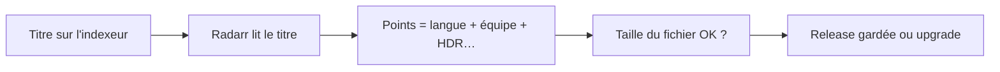

# French Profilarr Database

Profils **Radarr** et **Sonarr** pour la **scène française privée** : ce que tu vois sur C411 et les autres trackers (langue dans le titre, équipes, 4K compact…), pas un profil « international » générique.

| | |
|---|---|
| **Outil** | [Profilarr v2](https://v2.dictionarry.dev) (PCD 1.1.0) |
| **Version** | 2.0.0 |
| **Contenu** | 70 formats perso · 74 règles de titre · 10 profils · ~480 tests |

Questions ou retours : [issues](https://github.com/mcflykid/french-profilarr-database/issues).

### Comment Radarr choisit une release

---

## Par où commencer ?

| Tu veux… | Lis d’abord |
|----------|-------------|
| **Comprendre le projet (pourquoi ces choix)** | **[Pourquoi](docs/comprendre/pourquoi.md)** — référence complète, humains et IA |
| **Installer et synchroniser** | [Guide Profilarr](docs/installer/guide.md) |
| **Détail des scores** | [Principes](docs/comprendre/principes.md) → [Langue](docs/comprendre/langue.md) |
| **Modifier la base** | [Maintenir](docs/contribuer/maintenir.md) |

Après une mise à jour du dépôt : **Pull → Compile → Sync** (expliqué dans le [guide](docs/installer/guide.md)).

---

## Documentation (`docs/`)

Doc **complète** (tableaux, regex, journal, tests) + explication des **choix** (pas seulement des chiffres).  
**À lire en premier** : [pourquoi.md](docs/comprendre/pourquoi.md). Index : [docs/README.md](docs/README.md).

### 1 — Installer

| Page | C’est quoi ? |
|------|----------------|
| [guide.md](docs/installer/guide.md) | Pull, Compile, Sync, checklist |
| [interface.md](docs/installer/interface.md) | Boutons Sync, Drift, Upgrades |
| [profils.md](docs/installer/profils.md) | `FR-Films-4K`, `FR-Series-1080p`, etc. |
| [tailles.md](docs/installer/tailles.md) | Poids des fichiers (Go), délais torrent |

### 2 — Comprendre

| Page | C’est quoi ? |
|------|----------------|
| **[pourquoi.md](docs/comprendre/pourquoi.md)** | **Pourquoi** chaque grand choix (vs alternatives) — à lire en premier |
| [principes.md](docs/comprendre/principes.md) | Synthèse des priorités et seuils |
| [langue.md](docs/comprendre/langue.md) | VFF, MULTI, VFQ… |
| [equipes.md](docs/comprendre/equipes.md) | QTZ, SUPPLY, 4KLight… |
| [image-son.md](docs/comprendre/image-son.md) | HDR, Atmos, x265 |
| [calibrage.md](docs/comprendre/calibrage.md) | Ajuster avec de vrais titres, C411, **journal** |
| [limites.md](docs/comprendre/limites.md) | Ce que Radarr ne peut pas lire |
| [hors-scope.md](docs/comprendre/hors-scope.md) | Ce qu’on ne fait pas (remux catalogue, etc.) |

### 3 — Contribuer

| Page | C’est quoi ? |
|------|----------------|
| [maintenir.md](docs/contribuer/maintenir.md) | Tests, fichiers `ops/`, mettre la doc à jour |

Index détaillé : [docs/README.md](docs/README.md).

---

## Liens utiles

- [Installation Profilarr](https://v2.dictionarry.dev/profilarr-setup/installation)
- [Schema PCD](https://github.com/Dictionarry-Hub/schema) · [Dictionarry database](https://github.com/Dictionarry-Hub/database)

Importer dans Profilarr : **racine** de ce repo (`pcd.json` + dossier `ops/`).

---

*Maintenu par [mcflykid](https://github.com/mcflykid) — communauté FR.*
