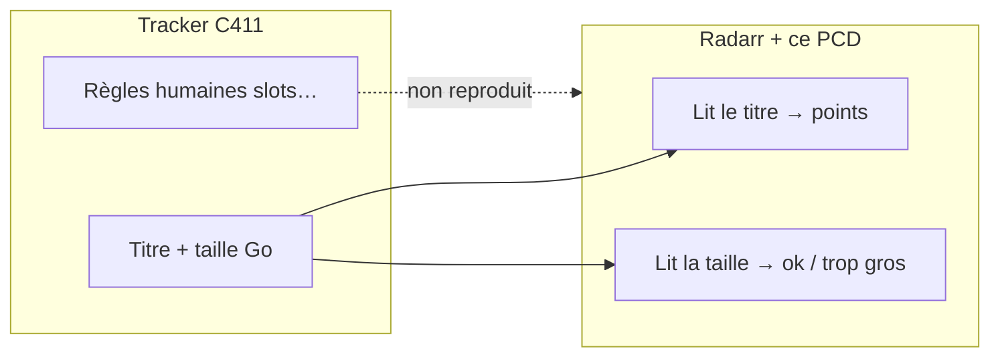

# Calibrage et C411

**En bref** : tu envoies de **vrais noms de fichiers** vus sur ton tracker ; on ajuste scores et tailles. Le PCD imite une partie des **règles C411** via le **titre** seulement — pas les slots ni le MediaInfo.

[← Index doc](../README.md) · [Pourquoi — calibrage terrain](pourquoi.md#10-calibrage-terrain-obligatoire-pour-les-scores-équipe-et-les-tailles) · [Équipes](equipes.md) · [Journal](#journal-des-calibrages-récents)

---

## Calibrage sur releases réelles

Envoie **5 à 30 titres complets** + tailles en Go (ex. captures C411). On met à jour regex, scores équipe, `ops/07` (poids cible).

## C411 vs ce que Radarr voit

C411 : modérateurs, **slots**, MediaInfo, langue qualifiée. **Radarr** : surtout le **titre** + la **taille**. Ci-dessous : ce qu’on **peut** coder en points, et ce qu’on **ne peut pas**.

### Ce que le PCD fait

| Règle C411 (résumé) | Implémentation PCD |
|---------------------|-------------------|
| **Langue** : `MULTI` qualifié (`MULTI.VFF`, `MULTI.VF2`, …) | CF `FR-MULTI-VFF`, `FR-MULTI-VF2`, `FR-MULTI-VFQ` ; `MULTI` seul → **`FR-MULTI-ambig`** (5,5k) pour indexeurs hors C411 |
| **VFF > VFQ** en priorité France | **FR-VFF** (5k) **>** **FR-MULTI-VFQ** (4,5k) et **FR-VFQ** (4k) |
| **WEB-DL** (untouched) **>** **WEBRip** (ré-encodé) en UHD | CF **`FR-WEBRip`** : **-750** sur **`FR-Films-4K`**, **`FR-Series-4K`**, **`FR-Anime-4K`** uniquement (même qualité `WEBRip-2160p` vs `WEBDL-2160p`) |
| **Éditions** (IMAX, Extended, …) ≠ doublon « même film » | Bonus **`IMAX`** / **`IMAX Enhanced`** / **`Theatrical`** si le tag est dans le titre |
| **4KLight / HDLight / HYBRID** | CF `FR-4KLight`, `FR-HDLight`, `FR-Hybrid` |
| **Repack / Proper** | `FR-Repack` (+ paliers 2/3) |
| **Groupes de confiance** | `FR-Team-*` calibrés sur releases réelles |

### Ce que le PCD ne fait pas (limites Radarr)

| Règle C411 | Pourquoi ce n’est pas dans le PCD |
|------------|-----------------------------------|
| **Slots** (ex. 2× WEB 1080p, quotas HDLight) | Aucun compteur de doublons par créneau — seulement préférence relative entre releases visibles |
| **MediaInfo** (bitrate min, canaux réels, langue piste) | Pas lu par Radarr à la sélection |
| **MUET** (piste muette interdite) | Non modélisé (pas de CF dédié volontairement) |
| **Hash / NFO** | Hors scope parser |
| **Doublon exact** (même encodeur + même taille) | Décision modérateur / règles tracker, pas le score CF |

En pratique : le PCD **désambiguïse** les titres concurrents ; il ne remplace pas la modération C411 ni les filtres UI du tracker.

### WEB-DL vs WEBRip (4K)

Sur C411, le **WEB-DL** non retouché est le créneau premium ; le **WEBRip** est un ré-encodage (souvent plus compact, parfois excellent — ex. **BONBON**). En **2160p**, à langue / équipe / HDR comparables, un titre **`WEB-DL`** gagne **~750 points** sur un titre **`WEBRip`** grâce à **`FR-WEBRip`**. En **1080p**, pas de malus dédié : le WEBRip reste courant (HDLight, scène compacte).

### Éditions IMAX

Si le titre contient **`IMAX`** (hors `NON-IMAX`) ou **`IMAX Enhanced`** (Disney+ / Bravia Core WEB), bonus modéré renforcé :

| Profil | IMAX | IMAX Enhanced |
|--------|-----:|--------------:|
| **4K** (`FR-Films-4K`, `FR-Series-4K`, `FR-Anime-4K`) | **1500** | **1800** |
| **1080p** films / Any | **1000** | **1200** |
| **720p** films | **650** | **845** |

C411 traite souvent **IMAX vs Theatrical** comme éditions distinctes (pas un doublon « même rip ») — aligné avec les CF **`IMAX`** / **`Theatrical`**.

### Torr9

Règles officielles, nomenclature, équipes présentes/interdites, API (15 req/min), RSS freeleech : **[torr9.md](torr9.md)**.

### Filtres de recherche C411 (référence)

Sur C411, les **filtres UI** ne sont pas dans Radarr : ce sont des raccourcis de recherche sur le tracker. La base PCD vise à reconnaître les **mêmes infos dans le titre** de la release. Tableau de correspondance :

| Filtre C411 | Dans le titre / Radarr | Couverture PCD |
|-------------|------------------------|----------------|
| **4K** | `2160p`, `4K`, UHD | Profils `FR-*-4K`, qualité native |
| **1080p / 720p / SD** | `1080p`, `720p`, `480p`… | Profils + qualités `ops/07` |
| **SDR, HDR10, HDR10+** | `HDR`, `HDR10`, `HDR10PLUS`… | CF `HDR`, `HDR10`, `HDR10+` |
| **Dolby Vision, DV+HDR10(+)** | `DV`, `DoVi`, souvent + `HDR` dans le nom | CF `Dolby Vision` (+ HDR séparés) |
| **MULTI, VFF, TRUEFRENCH** | `MULTI.VFF`, `MULTIVFF`, `TRUEFRENCH`… | `FR-MULTI-VFF`, `FR-VFF` |
| **VOSTFR, VFQ, VF2, MULTI.VF2** | `VOSTFR`, `VFQ`, `VF2`, `MULTI.VF2`, `MULTI.CA` | `FR-VOSTFR`, `FR-VFQ`, `FR-VF2`, `FR-MULTI-VF2`, `FR-MULTI-VFQ` |
| **VF** (générique) | `VF` seul (hors VF2/VFQ) | `FR-VFF` via `VF(?!Q|2)` |
| **BluRay, WEB, WEBRip, HDTV…** | `BluRay`, `WEB`, `WEBRip`, `WEB-DL`… | Qualité Radarr + malus **`FR-WEBRip`** (-750) en **4K** si `WEBRip` dans le titre |
| **H.265 / H.264 / AV1** | `x265`, `H265`, `H264`, `AVC`, `AV1` | CF `x265`, `h265`, `x264` ; **AV1 exclu** (-999999) |
| **Lossless / Lossy** | Pas un tag unique | Déduit : `TrueHD`, `FLAC`, `DTS-HD MA` vs `AAC`, `AC3`, `DD+` |
| **5.1 / 2.0 / 7.1** | `AC3.5.1`, `EAC3.5.1`, `AAC.2.0`… | Regex Dolby / AAC / DTS |
| **2D / 3D / 3D FSBS / HSBS** | `3D`, `SBS`, `half-OU`… | CF `3D` ; 3D souvent malusé / rare |
| **H.262 / H.263** | Très rare en scène FR actuelle | Non prioritaire |

**À retenir** : filtrer sur C411 **MULTI + 1080p + H.265** ne garantit pas le même tri que Radarr : chez toi, la **langue** (jusqu'à 8k, 1er tri) et les **équipes** (`FR-Team-*`, ~5,5k) pèsent en plus des filtres « technique ».

Quand tu calibres une équipe, note quels **filtres C411** tu utilises souvent — ça aide à choisir le profil (`FR-Films-1080p` vs `FR-Films-4K`) et les tailles `ops/07`.

### Ce que tu envoies (modèle)

Pour une **équipe** ou un **tracker**, envoie par message :

1. **Captures** ou liste de **5–30 titres** complets (ex. `Film.2024.MULTI.VFF.1080p.WEB.AC3.5.1.H264-Slay3R`).
2. Les **tailles** affichées (Go) — min / typique / max si possible.
3. **Résolution** dominante (1080p WEB, 2160p, BluRay, …).
4. Optionnel : indexeur (C411, Torr9) — reste interne, pas obligatoire dans le README public.

### Ce qu’on fait dans le dépôt

| Étape | Fichiers |
|-------|----------|
| Grammaire des titres | `ops/02`, `ops/04` |
| Nouvelle équipe | `ops/03`, `ops/04`, `ops/06` |
| Tailles media (Radarr **max ≤ 2000**) | `ops/07` |
| Tests sur vrais titres | `ops/11` (description avec **C411**, **Torr9**, **Calibrage**, ou nom d’équipe) |
| Doc | cette page + [journal](#journal-des-calibrages-récents) |

Puis : `python3 scripts/validate.py` → commit → **Pull → Compile → Sync** sur Radarr/Sonarr.

### Journal des calibrages récents

| Date | Élément | Changement principal |
|------|---------|----------------------|
| 2026-07 | **SUPPLY 4800 → 4000** | Sanction du `.mkv` interne générique (perd VFF/EAC3 à l'import → moteur de la boucle churn). SUPPLY-H264 (11350) passe désormais sous une clean H265 type ENIGMA (11500) ; SUPPLY-H265 reste devant. Complément de l'increment 1400 |
| 2026-07 | **Anti-churn : increment 500 → 1400** | Boucle d'upgrade infinie sur *House of the Dragon S03E04* : SUPPLY `…VFF…H264` scoré **12150** au grab mais `.mkv` générique → **10300** à l'import, ping-pong sans fin avec ENIGMA (11500, stable). L'increment 500 laissait passer l'écart (1200). Monté à **1400** (≈ un palier de langue) sur les 10 profils : bloque les grab-vs-import, garde l'upgrade `ambig→VFF` (+1500). Compromis : moins d'upgrades marginaux |
| 2026-07 | **Audio : objets/lossless malusés (inverse 2026-05)** | Écoute enceintes TV + **AirPods Pro 2** (Apple TV), **aucun AVR** : l'E-AC-3 JOC (DDP Atmos) force décodage objets + spatialisation BT → **lags** (*Enola Holmes 3* FW, fichier sain). Nouveaux scores (10 profils) : **Atmos / DTS:X / TrueHD −1500**, **DTS-HD MA −800**, **DTS-ES / DTS-HD HRA / DTS / FLAC / PCM −300** (Apple TV ne Direct Play **aucun** DTS). Cible = **DD+ 5.1** (500) puis **DD 5.1** (120). **Dolby Vision inchangé** (vidéo). Filet : format audio forcé DD 5.1 sur l'ATV pour le JOC non taggé |
| 2026-07 | **Fix DDP5.1 collé** | La regex `Dolby Digital +` ratait `DDP5.1` sans séparateur (*Obsession* BATGirl 4KLight, −500) et `DD+` littéral ; `DDP.5.1` pointé passait. Pattern élargi, `DDPA` (bundle Atmos) toujours exclu |
| 2026-07 | **Malus poids 2160p** | `FR-Lourd-2160p` **−1200** (≥ 20 Gio) et `FR-Tres-Lourd-2160p` **−1800** cumulé (≥ 28 Gio), Radarr seul, sur `FR-Films-4K`/`FR-Films-Any` — symétrique du malus 1080p ; le premium 17–26 Gio reste accepté mais passe derrière les 4K compacts (*Michael* : SUPPLY 22,9 Gio 16600 → 15400, Amen 3,9 Gio 18650 inchangé) |
| 2026-07 | **Fix casse DTS + audit exclusivité** | La regex d'exclusion `DTS-HD HRA ES` était sensible à la casse (seule sans `(?i)`) → `DTS-ES`/`DTS-HD.HRA` en majuscules cumulaient avec `DTS`/`DTS-HD MA`. Audit systématique sur 248 titres réels (langue, codecs, audio, HDR) : plus aucun cumul |
| 2026-07 | **Fix cumul VFF+VF2** | `FR-VFF` (5000, via `FRENCH`) se cumulait avec `FR-VF2` (6000) sur les titres `FRENCH.VF2` (*Enola* Floppy, +12150 au lieu de +7150). Négations « Pas de tag VF2 / VFQ » ajoutées à `FR-VFF` — un seul palier langue par release |
| 2026-07 | **Fix cumul x265+h265** | La regex `x265` matchait aussi `H265`/`HEVC` déjà couverts par `h265` → +1850 au lieu de +850 sur les titres `H265` (*Enola Holmes 3* FW). `x265` restreint au tag littéral (+`DS4K`) ; 4 tests d'exclusivité |
| 2026-07 | **Fix double langue VF2** | `FR-VF2` (6000) n'avait pas la condition « Pas de tag MULTI » (présente sur `FR-VFF`/`FR-VFQ`) → chaque `MULTI.VF2` cumulait 8000 + 6000 (*Enola Holmes 3*, +20200 au lieu de +14200). Condition ajoutée + tests. Aussi : **HDTV-2160p** ajouté aux groupes 2160p (parser Radarr devine HDTV quand DV/HDR précède WEB dans le titre) |
| 2026-07 | **Fix double langue (espaces)** | `FR-MULTI-ambig` matchait aussi les titres à **espaces** (`MULTI VFi` TR4KER) déjà couverts par `FR-MULTI-VFF` → +5500 fantômes (+14200 au lieu de +8700 sur *Detachment*). Lookahead élargi `\.` → `[ ._-]?`. Aussi : `max_bytes` explicite (1 Tio) sur les CF poids |
| 2026-07 | **Échelles fallback** | Plus de rejet « rien trouvé » : profils **4K** = 720p < 1080p < **2160p** (cutoff), profils **1080p** = 720p < **1080p**, `FR-Films-Any` = **SD < 720p < 1080p < 2160p** ; upgrade auto de qualité vers le cutoff (⚠️ re-téléchargement quand la meilleure qualité sort — coût ratio assumé). Hiérarchie perso : **4KLight > 4K > HDLight > 1080p > 720p** |
| 2026-07 | **Malus poids 1080p** | `FR-Lourd-1080p` **−1200** (≥ 5 Gio) et `FR-Tres-Lourd-1080p` **−1800** cumulé (≥ 8 Gio) — préférence fichiers légers (HDLight, x265 compact) vs gros Bluray audio-premium ; **Radarr seul** (season packs Sonarr fausseraient la taille) ; 1er usage de `condition_sizes`. Limite connue : taille absolue, un film de 3 h peut être malusé à tort |
| 2026-07 | **HDLight sur profils 4K** | `FR-HDLight` **+250** ajouté aux 3 profils 4K (cohérence fallback 1080p) ; rappel parser : HDLight « nu » (sans mot-source) deviné HDTV/WEBDL de façon instable par Radarr — les CF tags scorent quand même |
| 2026-07 | **Profils Radarr** | `FR-Films-Any` conservé (Radarr refuse la suppression) et recalé SD → 4K ; `FR-Films-720p` restauré pour la symétrie 3 profils par catégorie (10 profils au total) |
| 2026-06 | **Tailles : planchers anti-junk** | Fin des rejets « taille trop petite » : `min` WEB 2160p **34,5 → 17** (les 4KLight/WEBRip ~2,5–5 Go scorés +5000 étaient rejetés), 1080p **→ 8**, 720p **→ 5** (Radarr + Sonarr séries) |
| 2026-06 | **Tailles : plafonds anti-obèses** | `max` réels par qualité (films : 2160p **250** ≈ 30 Go, 1080p **150** ≈ 18 Go @120 min ; séries : 100–150 ; animé : 40–120) — borne dure contre les encodes hors cible scène FR compacte ; premium DV/Atmos ~17–26 Go toujours accepté |
| 2026-06 | **Anti-churn upgrades** | `upgrade_score_increment` **1 → 500** (10 profils) : pas de re-téléchargement complet pour un gain CF < 500 (Repack +120, Season Pack +120, x265 vs h265 +150) — protège ratio et cross-seed |
| 2026-05 | **Neostark (C411)** | `FR-Team-Neostark` **5300** si **4KLight** dans le titre ; `FR-4KLight` **3000** ; WEBRip sans tag → pas de bonus équipe |
| 2026-05 | **Naming ops/07** | `rename = 0` ; dossiers TMDB/TVDB ; formats fichier TRaSH d’origine (inactifs) ; Plex = tMM après archivage |
| 2026-05 | **Doc grab / import** | [limites.md](limites.md) : profil = tracker ; Plex/tMM = autre métier ; motifs tMM films/séries ; torrent vs `.mkv` ; pas un bug profil |
| 2026-05 | **Plex / Apple TV** | **TrueHD** malusé (−800 4K) ; **FR-Audio-71** −400 (pas de matériel **7.1**, TV seule) |
| 2026-05 | **Matériel foyer** | Fiches TV dans [image-son.md](image-son.md) : Toshiba (DV, ARC, pas Atmos TV) ; TCL QLED (DV/HDR10+, eARC, Atmos virtuel 2.1) — **bonus CF Atmos conservé** (proxy WEB, pas malus coût) |
| 2026-05 | **Torr9** | Doc [torr9.md](torr9.md) ; blockers **Dread-Team**, **EXTREME** (équipes interdites tracker) |
| 2026-05 | **C411 / parser** | Page calibrage + **`FR-WEBRip`** -750 (4K) ; bonus **IMAX** +50 % |
| 2026-05 | **Scoring qualité-first** | Langue **8k** max (1er tri) ; équipes **~5,5k** ; HDR/DV/Atmos **1k–3,5k** ; `upgrade_until` **60k** |
| 2026-05 | **Grille ×0,15** (intermédiaire) | Remplacée par rééquilibrage qualité-first |
| 2026-05 | **Upgrades CF** | Intermédiaire 999999 — remplacé par grille /50k |
| 2026-05 | **Tailles Mo/min** | 3 presets : **Radarr** (films, `preferred` ~42), **Sonarr** séries (`~60` WEB), **Anime-Sonarr** (`min` 5, `preferred` ~38) |
| 2026-05 | **Fix tailles Radarr** | Fin des `min` 900/600 (seuil ~97 Go sur *Up in the Air*) |
| 2026-05 | **Winks** (C411) | `FR-Team-Winks` 6600 ; tailles 1080p corrigées ensuite (voir ligne ci-dessus) |
| 2026-05 | **Audio** C411/Torr9 | `AC3.5.1`, `E-AC-3`, `MULTIVFF` ; exclusion E-AC-3 du CF DD classique |
| 2026-05 | **Slay3R** (C411) | Score 6000 ; WEB 1080p 600/1650/2000 ; regex **H264/H265/AVC** |
| 2026-05 | **Fix Radarr** | `max_size` plafonné à **2000** (limite API) — corrige l’erreur sync Media Management |
| 2026-05 | **C411** | Tableau filtres recherche ↔ CF / profils (référence doc) |
| 2026-05 | **SUPPLY** (C411) | ~200 releases : `preferred` WEB **2160p 95** (~10 Go/110 min) / **1080p 48** ; **FR-Team-SUPPLY 4800** ; tests `ops/11` ; `scripts/analyze_calibrage_supply.py` |
| 2026-05 | **MULTI.CA** (SUPPLY) | Tag québécois C411 → **FR-MULTI-VF2** (ex. *Super Mario Galaxy* 1080p) ; exclu de **FR-MULTI-VFF** |
| 2026-05 | **VFQ sous VFF** | **`FR-MULTI-VFQ` 4500** / **`FR-VFQ` 4000** ; `VF2` seul = dual FR+QC (8k/6k) |
| 2026-05 | **Règles C411 langue** | **`FR-MULTI-ambig` 5500** pour `MULTI` seul ; `MULTI.V*` explicite inchangé ; **MULTI.VOF** / **VFI** / **VFB** |

*(Ajouter une ligne ici à chaque calibrage releases réelles.)*

---

[← Index doc](../README.md) · [← README](../../README.md)
