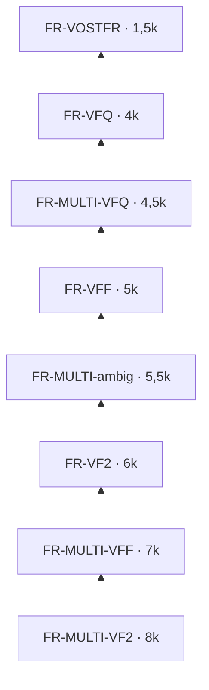

# Langue

**En bref** : plus le français est **clair dans le titre**, plus la release monte. Le meilleur cas : **MULTI.VF2** (France + Québec). **VOSTFR** reste en bas. Un **`MULTI` seul** (sans précision) = palier intermédiaire.

[← Index doc](../README.md) · [Pourquoi — langue](pourquoi.md#2-langue--premier-tri-hiérarchie-explicite) · [Principes](principes.md) · [Calibrage C411](calibrage.md)

---

## Pourquoi ces paliers (et pas d’autres)

| Décision | Alternative écartée | Choix retenu | Raison |
|----------|---------------------|--------------|--------|
| **`MULTI` seul** | Score 0 (pas FR) ou même score que `MULTI.VFF` | **`FR-MULTI-ambig` 5,5k** | Hors C411 le tag arrive souvent sans sous-précision ; 0 punirait à tort ; 7k sur-promettrait la conformité C411. |
| **`MULTI.VFF` / `MULTIVFF`** | Fusion avec `MULTI` ambigu | **7k** dédié | C411 et la scène FR explicites → meilleur palier multi France. |
| **`MULTI.VF2`** | Traiter comme VFQ | **8k** (meilleur palier) | Dual France + Québec nommé — cas rare et valorisé. |
| **VFQ / `MULTI.CA`** | Ban ou égal VFF | **4k / 4,5k**, **sous VFF 5k** | VFQ = repli Québec, pas équivalent VFF France ; confirmé en calibrage (*Super Mario Galaxy*, SUPPLY). |
| **VOSTFR** | Même niveau que VF | **1,5k** | Sous-titres seulement — gardé pour fansub, pas pour bibliothèque FR audio. |
| **Regex séparées VF2 / VFQ / VFF** | Une regex `VF.*` | **3 regex** | Évite qu’un `VFQ` déclenche VFF ou qu’un `VF2` soit lu comme VF générique. |

Cas terrain documentés : `ops/11` (Damsel `MULTI` seul, *La Momie* TRUEFRENCH/HDR, MULTI.CA). Journal : [calibrage.md](calibrage.md#journal-des-calibrages-récents).

---

### Tableau des scores (tous profils `FR-*`)

| Custom format | Score | Détection (résumé) |
|---------------|------:|---------------------|
| **FR-MULTI-VF2** | 8 000 | `MULTI` **et** **`VF2`** (dual FR + QC) |
| **FR-MULTI-VFF** | 7 000 | `MULTI` **et** tag France explicite (VFF, VOF, TRUEFRENCH, `MULTI.FRENCH`, …) |
| **FR-VF2** | 6 000 | **`VF2` seul** (dual FR + QC, sans `MULTI`) |
| **FR-MULTI-ambig** | 5 500 | **`MULTI` seul** : FR probable, variante non précisée (hors nommage C411) |
| **FR-VFF** | 5 000 | VFF, TRUEFRENCH, … **sans** `MULTI` |
| **FR-MULTI-VFQ** | 4 500 | `MULTI` **et** VFQ / VOQ / **`MULTI.CA`** — **sous VFF** |
| **FR-VFQ** | 4 000 | VFQ / VOQ / CA **sans** `MULTI` — **sous VFF** |
| **FR-VOSTFR** | 1 500 | VOSTFR, SUBFRENCH, FANSUB, FASTSUB |

**Règle C411** : avec plusieurs pistes, `MULTI` doit être **qualifié** (`MULTI.VFF`, `MULTI.VOF`, `MULTI.VFQ`, `MULTI.VF2`, …). Sur d’autres indexeurs, un **`MULTI` nu** arrive souvent quand même → palier **`FR-MULTI-ambig`** (5,5k) : *multi avec du français, variante inconnue*, **au-dessus de VFF seul**, **sous** `MULTI.VFF` explicite. **`MULTI.FRENCH`** reste **FR-MULTI-VFF** (7k).

| Situation | Tag release | CF |
|-----------|-------------|-----|
| 1 piste FR | `VFF`, `VOF`, `TRUEFRENCH`, `VFQ`, … | **FR-VFF** / **FR-VFQ** |
| Multi + FR **précisé** | `MULTI.VFF`, `MULTI.VOF`, `MULTI.VFQ`, … | **FR-MULTI-VFF** / **FR-MULTI-VFQ** |
| Multi + VFF **et** VFQ | `MULTI.VF2` | **FR-MULTI-VF2** |
| Multi **sans** sous-tag FR | `MULTI` seul (Torr9, etc.) | **FR-MULTI-ambig** |
| Pas de FR audio | `VOSTFR` | **FR-VOSTFR** |

### Regex langue (`ops/02`)

| Regex | Rôle |
|-------|------|
| **FR-Regex-MULTI** | `MULTI`, `MULTI.VFF`, **`MULTIVFF`** (collé C411), `MULTITRUEFRENCH`, `MULTI.FRENCH`, `\bMULTI\b` seul (évite `MultiVerse`) |
| **FR-Regex-VFF** | VFF, TRUEFRENCH, VFI, VOF, **`MULTIVFF`**, `MULTI.VFF`, VF générique (hors VF2/VFQ) |
| **FR-Regex-VF2** | **`VF2`** / `MULTI.VF2` / **`MULTIVF2`** (dual FR+QC) |
| **FR-Regex-VFQ** | VFQ, VOQ, **`MULTI.CA`**, **`MULTIVFQ`**, `MULTI.VFQ` |
| **FR-Regex-VOSTFR** | VOSTFR, SUBFRENCH, FANSUB, FASTSUB |

**Variantes cross-indexeurs** : `MULTI.TRUEFRENCH`, `MULTI.FRENCH`, `TRUEFRENCH` seul, etc. — cas **La Momie** (même rip, titres différents).

**Limite** : Radarr ne lit que le **titre**, pas le MediaInfo → [limites.md](limites.md).

---

---

[← Index doc](../README.md) · [← README](../../README.md)
