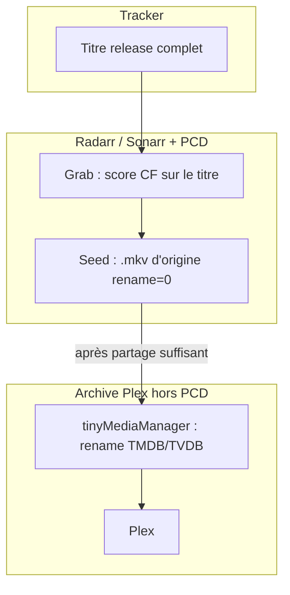
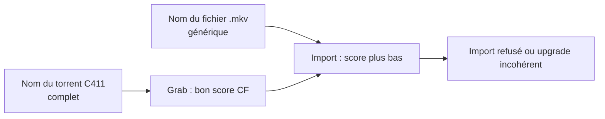

# Limites de Radarr

**En bref** : le **profil PCD** sert au **choix des releases sur le tracker** ; le fichier interne et l’**archive Plex** sont un autre métier ([deux métiers](#deux-métiers--profil-pcd-vs-fichier-interne-vs-plex)). Radarr/Sonarr ne lisent que le **nom** (+ taille), pas le MediaInfo ni les slots C411. Voir [torrent OK / `.mkv` générique](#torrent-bien-nommé-fichier-générique).

[← Index doc](../README.md) · [Calibrage](calibrage.md) · [Pourquoi — pas de rename](pourquoi.md#3-pas-de-renommage-radarr-include_in_rename--0)

---

| Même release, scores différents entre indexeurs | Titre différent (YGG ajoute `.FRENCH`) ou **`MULTI` seul** sur un indexeur : seul le titre **conforme C411** (`MULTI.VFF`, etc.) reçoit le bonus langue. Colonne **Langue** Radarr = métadonnée indexeur, pas le score CF. |

| Situation | Comportement |
|-----------|--------------|
| Même titre, deux trackers | Même score CF |
| Même fichier, **titres différents** | Scores différents (normal) |
| Tailles différentes | Qualité native + preset media divergent |
| `.mkv` dans le nom | Parsing parfois altéré |

**Ce n’est pas un bug Profilarr** : tout part du **titre** que Radarr/Sonarr utilise à chaque étape (souvent le titre indexeur au grab, parfois le nom du fichier à l’import — voir ci-dessous).

---

## Deux métiers : profil PCD vs fichier interne vs Plex

Le **profil PCD** (`FR-*`, Custom Formats, `ops/06`) sert au **choix des releases sur le tracker** : langue, équipe, HDR, taille, exclusions Remux/AV1, etc. Il lit le **titre de release** (souvent le nom du torrent sur C411), pas la lecture Plex.

Le **fichier `.mkv` à l’intérieur du torrent** et l’**archive Plex** sont un **autre métier**, en général géré en **deux temps** :

| Phase | Outil | Objectif | Ce qui compte pour le score CF |
|-------|--------|----------|--------------------------------|
| **Téléchargement / seed** | Radarr ou Sonarr + ce PCD | Bonne release, ratio, cross-seed | **Titre tracker** ; fichier souvent laissé tel quel (`rename = 0`) |
| **Bibliothèque Plex** | Outil type **tinyMediaManager** (exemple ci-dessous) | TMDB/TVDB, NFO, noms lisibles pour Plex | **IDs + titre + année** — plus les tags scène (`MULTI.VFF`, `-SUPPLY`) |

**À retenir** : ce dépôt **ne prétend pas** tout régler sans rename du fichier côté Radarr/Sonarr. Il ne remplace pas un renommage **Plex** (TMDB/TVDB, codecs en suffixe) après la phase seed. Baisser les scores du profil pour des `Film.mkv` génériques ne résoudrait ni Plex ni le cross-seed.

---

## Torrent bien nommé, fichier générique

Cas fréquent sur les trackers FR (dont C411), en **films (Radarr)** et en **séries (Sonarr)** :

| Élément | Exemple | Rôle |
|---------|---------|------|
| **Nom du torrent** (release) | `Film.2024.MULTI.VFF.1080p.WEB.H264-SUPPLY` | Complet : langue, équipe, qualité… → **bons points** au grab |
| **Fichier `.mkv` dans le torrent** | `Film.mkv` ou `S01E01.mkv` | Souvent **sans** les tags → score qui **chute** à l’import |

Les modérateurs soignent le **nom de release** ; l’encodeur ne renomme pas toujours le fichier à l’intérieur. Ce dépôt **ne peut pas corriger** ça dans les scores : les Custom Formats lisent surtout le **`release_title`** (voir `ops/04`), pas le contenu du disque ni le MediaInfo.

Le projet privilégie le **comportement torrent** (seed, cross-seed) plutôt que d’encourager des fichiers internes toujours bien tagués. **Baisser les seuils** ou « contourner » côté profil reviendrait à valider une mauvaise habitude des encodeurs — ce n’est pas l’intention du dépôt.

### Ce n’est pas un problème de profil

- Ce n’est **pas** un bug des scores `FR-*`, ni un mauvais réglage Radarr/Sonarr, ni un seuil `minimum_custom_format_score` à tort.
- C’est la combinaison **pratique des torrents** (fichier générique) + **limite Radarr/Sonarr** (à l’import, le logiciel ne peut pas deviner ce qui n’était écrit que dans le nom du torrent).
- Sans renommage du fichier, le logiciel **ne peut pas** reconstituer équipe / langue / HDR à partir d’un `Film.mkv` seul.

### Grab vs import (pourquoi ça bloque)

1. **Au téléchargement (grab)** : le logiciel lit le **nom du torrent** → les CF matchent (`MULTI.VFF`, `FR-Team-*`, HDR…) → la release peut être choisie.
2. **À l’import** : il retombe souvent sur le **nom du fichier** → les tags ne sont plus là → score en dessous du minimum → **import refusé**, alors que la release était la bonne.
3. **Import auto** juste après un grab : ça peut quand même passer si Radarr garde le **nom de release** du téléchargement ; le cas douloureux reste surtout **fichier générique + import manuel** ou mauvaise association fichier ↔ release.

### Dossiers oui, rename du fichier non (choix du dépôt)

Le PCD utilise **`rename = 0`** : le **fichier vidéo** garde son nom d’origine dans le torrent (ex. `Matrix.mkv`), pour le **ratio** et le **cross-seed** — re-seeder le **même fichier** sur plusieurs trackers sans le dupliquer ni le renommer. Voir [pourquoi.md §3](pourquoi.md#3-pas-de-renommage-radarr-include_in_rename--0).

Si Radarr/Sonarr renommaient tout (guides TRaSH), beaucoup d’imports auto passeraient plus facilement, mais le seed serait plus pénible : c’est le **parti pris** du dépôt.

On organise la bibliothèque en **dossiers** via `ops/07`. Le **fichier `.mkv`** reste le **nom torrent** (`rename = 0`, cross-seed) :

| App | Dossier (`ops/07`, actif) | Fichier `.mkv` (défaut) |
|-----|---------------------------|-------------------------|
| **Radarr** | `{Movie CleanTitle} ({Release Year}) {tmdb-{TmdbId}}` | **Inchangé** (nom d’origine du torrent) |
| **Sonarr** | `{Series TitleYear} {tvdb-{TvdbId}}` → `Season {season:00}` | **Inchangé** |

`ops/07` conserve les **formats fichier TRaSH d’origine** dans la config Profilarr (au cas où quelqu’un activerait `rename` un jour) ; avec **`rename = 0`**, ils ne s’appliquent pas. Le **renommage Plex** se fait avec **tinyMediaManager** après archivage — voir ci-dessous.

### Quelle convention pour Radarr, tinyMediaManager et Plex ?

**Ne pas viser un seul nom de fichier pour tout.** Chaque outil lit des choses différentes :

| Outil | Rôle | Ce qui compte vraiment | Dans le **nom de fichier** |
|-------|------|------------------------|----------------------------|
| **Radarr / Sonarr + PCD** | Choisir et suivre les **releases tracker** | **Titre de release** en base (grab), profil CF, taille | Pendant le seed : souvent **nom torrent** (`rename = 0`). Tags scène (`MULTI.VFF`, `-SUPPLY`) : **pas utiles à Plex** |
| **tinyMediaManager** | Bibliothèque **Plex** (scan, NFO, langues) | **TMDB/TVDB**, titre, année, **NFO** `fr`, connecteur Plex | `Titre (année) {tmdb-id}` + `[1080p, H264, AAC]` + `{edition-…}` **si détecté** — **sans source WEB/Bluray** si tu ne l’as pas pour tous les fichiers |
| **Plex** | Lecture | **Agent TMDB/TVDB** + **fichiers NFO** + dossiers propres | **Ne lit pas** les tags scène FR. `H264` vs `h264` : indifférent. Langue audio : **NFO / métadonnées**, pas `-MULTI.VFF` dans le nom |

**Recommandation (meilleure pratique avec ton workflow)**

1. **Phase seed (Radarr/Sonarr)** : `rename = 0`, dossiers `{tmdb}` / `{tvdb}` OK ; **ne pas** mettre équipe, `MULTI.VFF` ni `{Quality Title}` dans le `.mkv` (cross-seed + source souvent inconnue).
2. **Phase Plex (tMM sur le NAS)** : ton modèle actuel est le bon pour Plex :
   - **Avant les crochets** : identité (`titre`, `année`, `{tmdb-…}`, édition **optionnelle**).
   - **Dans les crochets** : `1080p` + codecs (**sans** WEB-DL / Bluray si tu n’as pas la source partout).
   - **Majuscules codecs** (`H264`, `AAC`) : **cosmétique** pour toi ; Plex s’en fiche — garde-les si tu préfères l’uniformité.
   - **NFO** + scrape TMDB : c’est ça qui fixe langue, édition et affichage Plex — pas le nom de release C411.
3. **Ne pas fusionner** les tags Radarr (CF, qualité native) dans le nom Plex : ils servent au **tracker**, pas au lecteur.
4. **Ne pas activer** `rename` sur Radarr/Sonarr pour la bibliothèque seed : le nom « parfait » pour Plex = **tMM après archivage** (ex. `[1080p, H264, AAC]`, édition si détectée).

#### Pourquoi pas le rename Radarr pour Plex ?

Exemple **tinyMediaManager** (archive) :

`Y A-T-Il Un Commandant Pour Sauver La Navy (1996) {tmdb-9101} {edition-Theatrical Edition} [1080p, H264, AAC].mkv`

Pendant le **seed** (`rename = 0`) : souvent `…Navy.mkv` ou le nom torrent — **c’est voulu** pour le cross-seed.

Radarr ne reproduit pas tMM (`1080p` seul, codecs en majuscules, pas de fausse source `Bluray 1080p`). Les CF équipe/édition restent au **score grab** ; le template fichier TRaSH dans `ops/07` est conservé mais **inactif** tant que `rename = 0`.

Les dossiers TMDB/TVDB **ne remplacent pas** un titre de release dans le fichier : ils ne font **pas** remonter le score des CF. L’archive Plex (tinyMediaManager) reste un réglage **séparé** — voir [Workflow hybride](#workflow-hybride-exemple-maintainer-hors-pcd).

### Si ça bloque chez toi

| Action | Détail |
|--------|--------|
| **Import manuel** | Quand l’import auto est refusé : **Activity** → import manuel. Associer le fichier au **nom de release** du torrent (tags `MULTI`, équipe, qualité…), pas seulement à `Film.mkv` ou au titre court de l’épisode. |
| **Vérifier après import** | Fiche film/série : le **nom de release** d’origine doit être **en base** (comme sur le tracker). Si oui, Radarr/Sonarr savent ce que tu as et évitent souvent un upgrade inutile. |
| **Renommage Plex** | Après seed : **tinyMediaManager** sur le NAS (pas le rename Radarr, pour ne pas casser le cross-seed). |
| **Ignorer la release** | Passer son chemin si l’équipe ne nomme jamais correctement les fichiers internes. Sur le tracker, une **note / retour** sur la team peut aussi signaler le problème (hors scope du PCD). |

### Renommage des fichiers (hors dépôt)

- **Défaut du dépôt** : `rename = 0` pour la communauté FR en cross-seed.
- Le dépôt garde **`rename = 0`** : cross-seed FR. Renommage **Plex** = **tinyMediaManager**, pas Radarr.

### Workflow hybride (exemple maintainer, hors PCD)

Combinaison **seed** (profil PCD + `rename = 0`) puis **archive Plex** (tinyMediaManager). Ce n’est **pas** imposé par le dépôt ; les motifs ci-dessous sont un **exemple** pour que Plex identifie bien les fichiers (connecteur **Plex**, métadonnées **TMDB** films / **TVDB** séries, NFO `fr`).

| Étape | Action |
|-------|--------|
| 1. **Seed** | Fichier inchangé (`Matrix.mkv`, etc.), cross-seed tant que le ratio le demande. Le PCD a déjà servi au **grab**. |
| 2. **Archivage** | Copie ou déplacement vers le NAS ; **tinyMediaManager** scrape + rename (pas de rename auto au scrape : `renameAfterScrape: false`, rename lancé à la main quand tu archives). |
| 3. **Plex** | Scan de la bibliothèque archive. |
| 4. **Re-import Radarr/Sonarr** (optionnel) | Depuis l’archive renommée : suivi et upgrades possibles **si** le **nom de release** reste correct en base — les noms Plex ne remplacent pas les tags scène pour les CF. |

**Formats de renommage tinyMediaManager (exemple)** — à adapter chez toi ; espaces remplacés par `_` si besoin, `:` → `-` :

| Type | Dossier | Fichier vidéo |
|------|---------|----------------|
| **Film** | `${title} (${year})` (ton tMM peut encore ajouter l’édition si tu veux) | `${title} (${year}) {tmdb-${tmdb}} […]` côté Plex ; `ops/07` sans édition |
| **Série** | `${showTitle} (${showYear})` puis `Season ${seasonNr2}` | `${showTitle} (${showYear}) - S${seasonNr2}E${episodeNr2} - […]` — aligné |

Exemples de noms obtenus (illustration) :

- Film : `Inception (2010) {tmdb-27205} [1080p, H265, EAC3].mkv`
- Épisode : `Breaking Bad (2008) - S01E01 -  [1080p, H264, AC3].mkv`

**Limites de ce workflow**

- Après rename Plex, **plus de seed / cross-seed** sur ces copies (fichier et chemin ne correspondent plus au torrent d’origine).
- Les CF **ne matchent plus** les suffixes Plex (`[1080p, H265, …]`) comme un titre C411 : l’archive sert à **Plex**, pas à re-scorer la scène FR.
- Un re-import depuis l’archive ne « répare » pas magiquement les upgrades : il faut toujours une **release** cohérente en base Radarr/Sonarr (voir [Si ça bloque](#si-ça-bloque-chez-toi)).

---

### Tests de référence (`ops/12`)

- **La Momie** (TMDB 564) — QTZ 4KLight vs Slay3R WEB vs TyHD vs Remux vs AV1
- Variante TRUEFRENCH / HDR (cross-indexeur)
- **Person of Interest** — `MULTI.FRENCH` (DELIRIUS)
- **Incendies** — VOQ sans MULTI vs MULTI.VOQ
- **Demon Slayer** — WEB CR MULTI VFF

---

[← Index doc](../README.md) · [← README](../../README.md)
