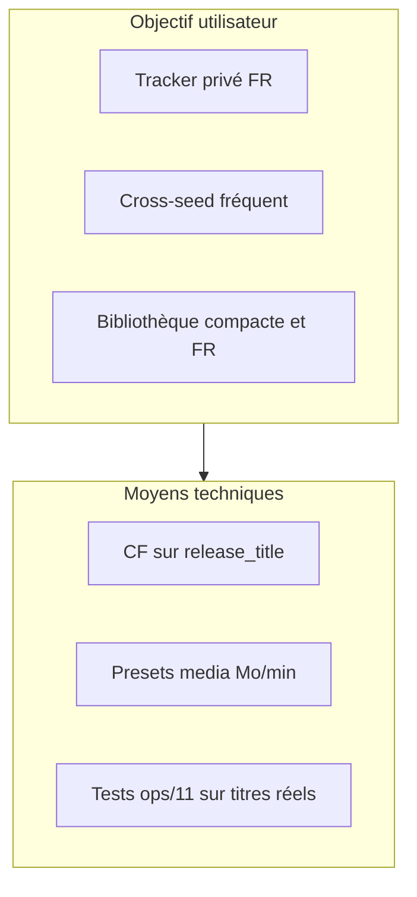

# Pourquoi ce projet existe et comment il décide

**Document de référence** pour comprendre — et pour toute personne ou **IA** qui modifiera la base plus tard.  
Chaque changement dans `ops/` doit rester **aligné** avec les intentions ci-dessous. Si une règle métier change, **mettre à jour cette page** en même temps que le SQL.

[← Index doc](../README.md) · [Principes](principes.md) · [Langue](langue.md) · [Calibrage](calibrage.md)

---

## En bref

| Question | Réponse |
|----------|---------|
| **Quel problème ?** | Les profils TRaSH / Dumpstarr « internationaux » ne reflètent pas ce que les **trackers privés FR** valorisent dans le **titre** des releases. |
| **Quelle solution ?** | Des **Custom Formats** (points sur le nom de fichier) + **tailles** cibles + **10 profils** `FR-*`, calibrés sur de **vraies releases** (C411, Torr9, …). |
| **Principe n°1** | **Langue d’abord** (écart ~1k–1,5k entre paliers, plafond **8k**) — puis équipe, puis image/son. |
| **Principe n°2** | On lit ce que **Radarr peut lire** : le **titre** et la **taille** — pas le MediaInfo, pas les slots C411. |
| **Principe n°3** | **Encodes compacts** pour la maison (HEVC, 4KLight, WEB par équipes) — **pas** remux catalogue / AV1 / full disc. |

---

## Public visé (et qui n’est pas visé)

**Visé** : utilisateurs Radarr/Sonarr sur **trackers francophones privés** ; habitudes de nommage (`MULTI.VFF`, `4KLight`, `-SUPPLY`) ; souvent **cross-seed** (même fichier, titres différents selon l’indexeur).

**Pas visé** :

- Usenet-first, délais longs, catalogues **remux** 60 Go+
- Chartes qui **bannissent le VFQ** (ici VFQ = repli sous VFF, pas exclusion)
- Remplacement de la **modération** ou des **slots** C411 (voir [limites.md](limites.md), [calibrage.md](calibrage.md))

Si tu ne partages pas l’objectif « **encode compact FR dans le titre** », ce dépôt n’est probablement pas le bon profil.

---

## Décisions structurantes (à ne pas inverser sans relire tout)

Chaque bloc suit le même format : **contexte → alternative écartée → choix retenu → pourquoi → où c’est dans le code**.

### 1. Scores CF dominants (pas seulement la « qualité » Radarr)

| | |
|--|--|
| **Contexte** | Sur la scène FR, la langue et l’équipe sont souvent dans le **nom** ; la qualité native `WEBDL-1080p` vs `WEBRip-1080p` ne suffit pas à trancher. |
| **Alternative écartée** | Profil type « qualité seule » (Dumpstarr pur) sans hiérarchie FR forte. |
| **Choix retenu** | Somme de CF sur le **titre** ; `upgrade_until_score` = **60 000** ; langue max **8k**, équipes ~**5,5k**, HDR/DV en second plan. |
| **Pourquoi** | Deux releases « WEB 1080p » peuvent avoir le même rang Radarr mais des titres `MULTI.VFF` vs `VOSTFR` — sans CF, la mauvaise gagne. |
| **Fichiers** | `ops/06-quality-profiles.sql`, [principes.md](principes.md) |
| **Ne pas** | Remonter `minimum_custom_format_score` vers 20k+ (bloque les upgrades) sans recalibrer toute la grille. |

### 2. Langue = premier tri (hiérarchie explicite)

| | |
|--|--|
| **Contexte** | C411 exige un `MULTI` **qualifié** ; Torr9/YGG envoient parfois `MULTI` seul ou suffixes `.FRENCH` incohérents. |
| **Alternative écartée** | Un seul CF « français » ; traiter `MULTI` nu comme `MULTI.VFF` (7k) ; mettre VFQ au même niveau que VFF. |
| **Choix retenu** | Paliers séparés : `FR-MULTI-VF2` (8k) > `FR-MULTI-VFF` (7k) > … > `FR-MULTI-ambig` (5,5k) pour `MULTI` seul > `FR-VFF` (5k) > `FR-MULTI-VFQ` / `FR-VFQ` (4,5k / 4k) > `FR-VOSTFR` (1,5k). |
| **Pourquoi** | Refléter la **priorité France** tout en **ne punissant pas** les indexeurs hors C411 (`MULTI` ambigu ≠ 0) ; VFQ reste un **repli** sous VFF France confirmé. |
| **Fichiers** | `ops/02` (regex), `ops/04`, `ops/06`, [langue.md](langue.md), tests `ops/11` (La Momie, Damsel, …) |
| **Ne pas** | Fusionner VF2/VFQ dans une regex « VF » unique ; remettre `MULTI` seul en `FR-MULTI-VFF` sans cas de test. |

### 3. Pas de renommage Radarr (`include_in_rename = 0`)

| | |
|--|--|
| **Contexte** | Cross-seed et ratio : le nom sur le tracker doit rester lisible et stable. |
| **Alternative écartée** | Renommage TRaSH agressif `{Movie Title}…`. |
| **Choix retenu** | Tous les CF FR avec `include_in_rename = 0`. |
| **Pourquoi** | Le **titre indexeur** est la source de vérité pour le score ; renommer casse la lisibilité sur le tracker et le pairing cross-seed. |
| **Fichiers** | `ops/03-custom-formats.sql` |

### 4. Exclusions dures (−999999) : Remux, Full Disc, AV1, Upscaled, x264@2160p

| | |
|--|--|
| **Contexte** | Objectif **bibliothèque domestique** (TV, box), pas archive lossless. |
| **Alternative écartée** | Garder les remux avec malus léger ; autoriser AV1 « pour la qualité ». |
| **Choix retenu** | Score **−999999** (jamais sélectionné) sur ces CF. |
| **Pourquoi** | Un malus « fort » peut encore perdre sur un edge case ; −999999 garantit l’intention même avec d’autres CF positifs. |
| **Fichiers** | `ops/06`, CF `Remux`, `AV1`, `Full Disc`, etc. |
| **Ne pas** | Assouplir pour « un film en remux » sans profil dédié `FR-Films-Any` + conscience du ratio. |

### 5. Repacks : `doNotPrefer` natif + CF `FR-Repack*`

| | |
|--|--|
| **Contexte** | Les PROPER/REPACK apparaissent **dans le titre** sur la scène FR. |
| **Alternative écartée** | `propers_repacks = prefer` côté Radarr (comportement générique). |
| **Choix retenu** | `doNotPrefer` + bonus CF si `PROPER`, `REPACK`, `REAL` dans le titre (paliers 2/3). |
| **Pourquoi** | Contrôle fin du **score** (repack 3 > repack 2 > repack) et cohérence avec les titres réels. |
| **Fichiers** | `ops/07`, `ops/06`, [equipes.md](equipes.md) (signatures) |

### 6. Équipes : 16× `FR-Team-*`, pas ~900 regex

| | |
|--|--|
| **Contexte** | [Profilarr-database-french-regex](https://github.com/Jojont54/Profilarr-database-french-regex) modélise une regex par team (~900 fichiers). |
| **Alternative écartée** | Copier le modèle Jojont54 ; ignorer les équipes (tout en tiers génériques). |
| **Choix retenu** | **16 groupes** calibrés + `FR-Tier-01/02` ; détection `-TEAM` en fin de titre. |
| **Pourquoi** | Maintenance **tenable** et **rebase** Dictionarry possible ; gain marginal des teams rares vs coût de sync/PR. |
| **Fichiers** | `ops/03`, `ops/04`, `ops/06`, [equipes.md](equipes.md), journal [calibrage.md](calibrage.md) |
| **Ne pas** | Ajouter 50 teams sans releases réelles documentées dans `ops/11` + journal. |

### 7. Trois presets media (pas un par profil qualité)

| | |
|--|--|
| **Contexte** | Films ~2h, épisodes séries ~45 min, animé ~24 min — mêmes Mo/min ≠ mêmes Go cibles. |
| **Alternative écartée** | Un bundle `FR-Media-*` par profil `FR-Films-4K` (ancien modèle). |
| **Choix retenu** | `FR-Media-Radarr`, `FR-Media-Sonarr`, `FR-Media-Anime-Sonarr` ; **max_size ≤ 2000** (limite API). |
| **Pourquoi** | Profilarr v2 : **un triplet** media par instance ; évite les seuils absurdes (ex. `min` 900 → ~97 Go sur *Up in the Air*). |
| **Fichiers** | `ops/07`, [tailles.md](../installer/tailles.md) |
| **Ne pas** | Remonter les `min` Radarr vers des valeurs « TRaSH international » sans recalcul Mo/min × durée. |

### 8. WEB-DL vs WEBRip en 4K (malus léger, pas interdit)

| | |
|--|--|
| **Contexte** | C411 : WEB-DL untouched > WEBRip ; BONBON et autres font d’excellents WEBRip compacts. |
| **Alternative écartée** | Interdire WEBRip (−999999) ; ignorer la distinction (même score). |
| **Choix retenu** | CF **`FR-WEBRip`** : **−750** sur profils **4K** seulement. |
| **Pourquoi** | À **même langue/équipe/HDR**, préférer WEB-DL sans bloquer les bons WEBRip ni pénaliser le 1080p où le Rip est courant. |
| **Fichiers** | `ops/02`, `ops/06`, [calibrage.md](calibrage.md) |

### 9. Pas de CF MUET, pas de slots, pas de MediaInfo

| | |
|--|--|
| **Contexte** | Règles C411 humaines (piste muette, quotas par créneau, bitrate mini). |
| **Alternative écartée** | Simuler slots avec des CF ; lire le NFO via hack. |
| **Choix retenu** | **Hors scope** — voir [limites.md](limites.md), [hors-scope.md](hors-scope.md). |
| **Pourquoi** | Radarr **ne expose pas** ces signaux à la sélection ; faux sentiment de conformité C411 serait pire qu’une doc honnête. |
| **Ne pas** | Ajouter MUET « parce que C411 » sans API Radarr fiable sur la piste muette dans le titre. |

### 10. TrueHD malusé (foyer Plex + Apple TV 4K)

| | |
|--|--|
| **Contexte** | TrueHD en Direct Play rare sur Apple TV 4K ; transcodage audio serveur (ex. TrueHD → FLAC) confirmé terrain (Tautulli). Foyer : ATV 4K v1/v2, Freebox ; Shield 2017 secondaire. |
| **Alternative écartée** | Garder TrueHD +1800 en 4K (qualité « max » sur le papier). |
| **Choix retenu** | **TrueHD −800** (4K), **−500** (1080p), **−350** (720p) ; **Atmos** / **DD+** inchangés. |
| **Pourquoi** | Même équipe et langue : `…EAC3.5.1.Atmos…` gagne sur `…TrueHD.7.1.Atmos…` — moins de charge NAS, meilleur Direct Play ATV. |
| **Fichiers** | `ops/06`, [image-son.md](image-son.md) |
| **Ne pas** | Remettre TrueHD en bonus fort sans revoir la cible lecteurs. |

**Atmos (ne pas confondre)** — fiches TV : **Toshiba 58U2963DG** = Dolby Audio, **pas** d’Atmos TV ; **TCL 55QLED780K** = Atmos **virtuel** 2.1 seulement. L’immersion « plafond » n’existe pas sans barre/AVR. On **garde le bonus Atmos** : pas un coût disque comme TrueHD/7.1, mais un **repère titre** vers le WEB `DDP`/`EAC3` (léger, Direct Play). **Aucune raison** de maluser ou retirer ce CF tant que la chaîne reste ATV→Plex→TV. Détail : [image-son.md](image-son.md) (foyers + tableau « garder Atmos »).

### 11. Préférence 5.1 (malus `7.1` dans le titre)

| | |
|--|--|
| **Contexte** | **Pas de matériel 7.1** (pas d’enceintes arrière / surround dédié) — lecture sur **TV classique** (stéréo ou downmix TV). Le **7.1** du fichier n’apporte rien à l’écoute ; il alourdit souvent le Blu-ray (`TrueHD 7.1`). Le **5.1** correspond à ce que la scène WEB annonce déjà (`EAC3.5.1`, `AC3.5.1`) et reste compatible TV / barre simple. |
| **Alternative écartée** | CF bonus « 5.1 » redondant avec `AC3.5.1` / `EAC3.5.1` déjà dans DD+ / DD. |
| **Choix retenu** | CF **`FR-Audio-71`** : **−400** si `7.1` apparaît dans le titre. |
| **Pourquoi** | Ne pas « payer » en score une piste qu’on ne peut pas exploiter ; à qualité égale, privilégier `…5.1…` / WEB plutôt que `…7.1…` (souvent cumulé avec TrueHD, cf. §10). |
| **Fichiers** | `ops/02` `FR-Regex-Audio-71`, `ops/06`, [image-son.md](image-son.md) |

### 12. Calibrage terrain obligatoire pour les scores « équipe » et les tailles

| | |
|--|--|
| **Contexte** | Un score théorique (ex. Winks 6600) puis ajusté après captures C411 réelles. |
| **Alternative écartée** | Copier les scores Dumpstarr ; ajuster « au feeling » sans tests. |
| **Choix retenu** | `ops/11` avec titres réels ; journal dans [calibrage.md](calibrage.md) ; scripts (`validate.py`, `analyze_calibrage_supply.py`, …). |
| **Pourquoi** | La scène FR **évolue** (SUPPLY 2160p ~10 Go, `MULTIVFF` collé, `AC3.5.1` Torr9) — seuls les titres réels valident la regex. |
| **Fichiers** | `ops/11`, `scripts/`, journal |

---

## Grille de scores (référence complète)

Ordre de grandeur **entre releases déjà en français** (hors −999999) :

| Couche | Exemples | Plafond typique |
|--------|----------|-----------------|
| Langue | `FR-MULTI-VF2` … `FR-VOSTFR` | **8 000** |
| Équipe | `FR-Team-QTZ` … `FR-Tier-02` | **~5 500** |
| Image / son | DV, HDR10+, Atmos, x265, `FR-4KLight` | **~4 500** cumul possible |
| Édition | IMAX, Theatrical | **~1 800** |
| Malus source | `FR-WEBRip` (4K) | **−750** |

**Total réaliste** sur une release premium : ~**22k–28k** / **60k** (`upgrade_until_score`).  
Détail par CF : [langue.md](langue.md), [equipes.md](equipes.md), [image-son.md](image-son.md), [principes.md](principes.md).

---

## Carte de la documentation (contenu complet)

| Page | Contient (référence complète) |
|------|-------------------------------|
| [principes.md](principes.md) | Tableau synthèse choix + seuils `ops/06` |
| [langue.md](langue.md) | Scores, regex `ops/02`, cas C411 / cross-indexeur |
| [equipes.md](equipes.md) | Scores 16 teams, tiers, signatures 4KLight/HDLight |
| [image-son.md](image-son.md) | HDR, audio (exclusions DD/DTS), codecs, streamers |
| [calibrage.md](calibrage.md) | C411 vs parser, filtres UI, workflow, **journal** |
| [torr9.md](torr9.md) | Règles Torr9, nomenclature, équipes, écarts PCD |
| [limites.md](limites.md) | Comportement multi-indexeurs, tests `ops/12` |
| [hors-scope.md](hors-scope.md) | Slots, rejets, roadmap |
| [tailles.md](../installer/tailles.md) | Tableaux Mo/min Radarr/Sonarr/Anime |
| [profils.md](../installer/profils.md) | Liste des 10 profils `FR-*` |
| [maintenir.md](../contribuer/maintenir.md) | CI, structure `ops/`, règles de mise à jour doc |

---

## Pour les IA et mainteneurs : avant de modifier `ops/`

1. Lire **cette page** et la section concernée (langue, tailles, équipe…).
2. Identifier la **décision** touchée (tableau § Décisions structurantes).
3. Modifier `ops/` + **`ops/11`** (titre réel) + page détail + **journal** si calibrage terrain.
4. Lancer `python3 scripts/validate.py`.
5. Si l’intention change (pas seulement un chiffre) : **mettre à jour ce fichier `pourquoi.md`**.

---

[← Index doc](../README.md) · [← README](../../README.md)
