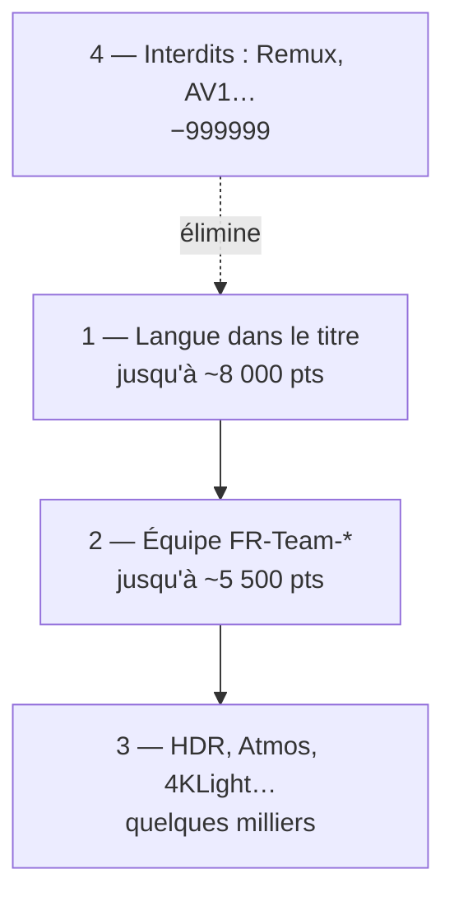

# Principes

**En bref** : Radarr additionne des **points** selon le **nom de la release** sur le tracker. D’abord la **langue française**, ensuite l’**équipe**, ensuite l’**image et le son**. Remux catalogue et AV1 sont **écartés** (−999999).

[← Index doc](../README.md) · **[Pourquoi (référence complète)](pourquoi.md)** · [Langue](langue.md) · [Équipes](equipes.md)

> **Document principal des intentions** : [pourquoi.md](pourquoi.md) — chaque choix vs alternative, pour humains et IA. Cette page = synthèse + seuils techniques.

---

## En une minute

Les profils « internationaux » (TRaSH, Dumpstarr) ne collent pas à la scène FR : on veut **MULTI.VFF**, **4KLight** compact, **WEB** par équipes connues — pas des **remux** de 60 Go.

| Étape | Ce qu’on regarde | Ordre de grandeur |
|-------|------------------|-------------------|
| 1 | Langue (MULTI.VFF, VFF, VFQ…) | jusqu’à **8 000** |
| 2 | Équipe (−QTZ, SUPPLY…) | jusqu’à **~5 500** |
| 3 | HDR, Atmos, 4KLight dans le titre | **100 – 4 500** |
| 4 | Interdit (Remux, AV1…) | **−999999** |

**Pour qui** : trackers privés FR, souvent **cross-seed** (même fichier, titres parfois différents).

**VFQ** : accepté en **repli** sous le VFF France — pas banni.

---

## Tous les choix expliqués (synthèse)

Tableau rapide — le détail « contexte / alternative / ne pas casser » est dans **[pourquoi.md](pourquoi.md)**.

| Choix | On ne fait pas | Pourquoi (résumé) |
|-------|----------------|----------|
| **Scores CF dominants** | Tout miser sur la qualité native seule | La scène FR se lit dans le **titre** (MULTI, 4KLight, équipe) |
| **`rename = 0`** | Renommage Radarr agressif | Habitude trackers FR, cross-seed, lisibilité ratio |
| **Remux / Full Disc / AV1 / Upscaled → -999999** | Catalogue remux / AV1 | Encodes domestiques, compat TV/box |
| **`propers_repacks = doNotPrefer`** | Repack natif « Prefer » | Géré par **FR-Repack** / **-2** / **-3** dans le titre |
| **Torrent only, délai 0** | Usenet / délais longs | `FR-Delay-*` : torrent, `torrent_delay = 0` |
| **x265 favorisé en 1080p/720p** | Malus HEVC sous 4K (Dumpstarr) | Scène FR = encodes compacts HEVC |
| **VFQ / VOQ acceptés** | Ban VFQ | **Repli** sous VFF : `FR-MULTI-VFQ` / `FR-VFQ` (pas exclusion) |
| **17 équipes `FR-Team-*`** | ~900 regex « une par team » | Maintenance tenable, rebase Dictionarry possible |
| **Presets media** | Bundle par profil qualité | **Radarr** + **Sonarr séries** + **Sonarr animé** (`ops/07`) |
| **Seuils profil type Dumpstarr** | `minimum = 20000` (ancienne base) | Évite upgrades bloqués ; priorité FR reste dans les CF |

### Seuils profil natifs (`ops/06`)

| Profil type | `minimum_custom_format_score` | `upgrade_until_score` | `upgrade_score_increment` |
|-------------|------------------------------:|----------------------:|--------------------------:|
| Films 1080p | **400** | **60000** | **1400** |
| Films / Series / Anime **4K** | **500** | **60000** | **1400** |
| Series / Anime 1080p/720p, Films 720p/Any | **0** | **60000** | **1400** |

**Philosophie scoring** (trackers FR, 2026-05) : la **langue** = **1er tri** (écart **1k–1,5k** entre paliers, max **8k**). La **qualité** (équipe **~5,5k**, DV/HDR **~3,5k**, Atmos **~2,5k**, x265, 4KLight) **décide** entre deux releases déjà françaises. Top ≈ **22k–28k** ; plafond upgrades **60k**. Tailles : preset media `ops/07` (Mo/min).

**Incrément 1400 (2026-07, anti-churn renforcé)** : un upgrade n'est re-téléchargé que s'il rapporte **au moins +1400** points CF ≈ **un palier de langue complet** (ex. `MULTI` ambigu → `MULTI.VFF` = +1500). En dessous, pas de re-téléchargement : ni équipe légèrement supérieure, ni codec (x265 vs h265 +150/+850), ni bonus cosmétique (Repack +120, Season Pack +120). **Pourquoi si haut** : bloque les **boucles grab-vs-import** — une release au titre gonflé (ex. SUPPLY `…VFF…H264` scoré au grab mais dont le `.mkv` générique retombe plus bas à l'import) ping-pongait sans fin avec une release stable ([limites.md — grab vs import](../comprendre/limites.md#grab-vs-import-pourquoi-ça-bloque)). L'ancien 500 laissait passer ces écarts (~1200). Compromis assumé : moins d'upgrades marginaux, mais fini les re-téléchargements en boucle — cohérent avec la priorité **ratio / cross-seed / fichiers compacts**.

---

---

[← Index doc](../README.md) · [← README](../../README.md)
