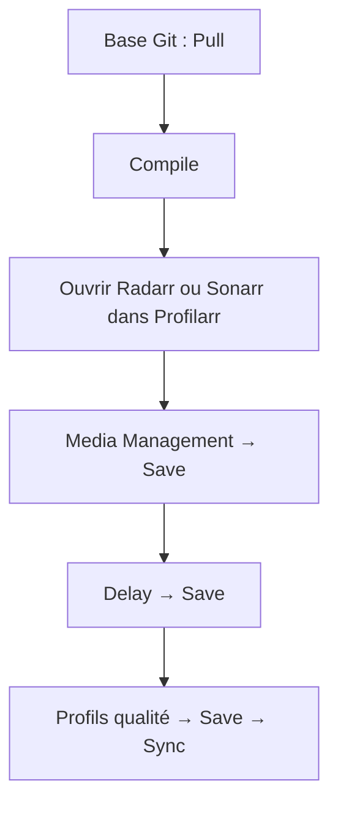

# Guide d’installation

**En bref** : lier ce repo dans Profilarr → **Pull** → **Compile** → sur chaque Radarr/Sonarr : régler **tailles** + **délai** + **profil** → **Save** → **Sync**.



[← Index doc](../README.md) · [Tailles](tailles.md) · [Profils](profils.md)

---

### Base Git (dépôt PCD)

1. Lier `https://github.com/mcflykid/french-profilarr-database`
2. **Pull** — importe les 11 fichiers `ops/*.sql` (`updated:11` = OK)
3. **Compile** — **obligatoire** : remplit le cache (profils, delays, presets `FR-Media-*` visibles dans l’UI)

Sans **Compile**, les listes peuvent rester vides ou obsolètes.

### Sync par instance (Radarr / Sonarr)

Le **Pull** sur la base **ne configure pas** Radarr/Sonarr. Menu **Arr** → instance → onglet **Sync** (≠ Pull de la base).

Bandeau *« Quality profiles require media management settings and a delay profile »* = section **non sauvegardée** → **Save** sur chaque bloc.

**Ordre obligatoire** :

```text
1. Media Management  →  Save
2. Delay profile     →  Save
3. Quality profiles  →  Save  →  Sync
```

#### Media Management — un preset par application

**Un seul triplet** par instance (pas un preset par profil `FR-Films-4K`) :

| Menu Profilarr | Radarr | Sonarr |
|----------------|--------|--------|
| Naming | **`FR-Media-Radarr`** | **`FR-Media-Sonarr`** |
| Quality definitions | **`FR-Media-Radarr`** | **`FR-Media-Sonarr`** |
| Media settings | **`FR-Media-Radarr`** | **`FR-Media-Sonarr`** |

Les **trois** menus doivent pointer vers le **même** nom.

#### Delay profile

| Instance | Choisir puis **Save** |
|----------|----------------------|
| Radarr | **`FR-Delay-Radarr`** (`ops/07`) |
| Sonarr | **`FR-Delay-Sonarr`** (`ops/09`) |

#### Profils qualité

Radarr : `FR-Films-720p`, `FR-Films-1080p`, `FR-Films-4K`, `FR-Films-Any`  
Sonarr : `FR-Series-*`, `FR-Anime-*` → **Save** → **Sync**.

Logs `arr.sync.* (skipped)` = config instance **pas encore enregistrée** — pas une erreur SQL du dépôt.

### Checklist Radarr / Sonarr

**Radarr**

- [ ] Base : **Pull** + **Compile**
- [ ] Sync → Media : `FR-Media-Radarr` sur les **3** menus → **Save**
- [ ] Delay : `FR-Delay-Radarr` → **Save**
- [ ] Quality profiles : au moins un `FR-Films-*` → **Save** → **Sync**

**Sonarr**

- [ ] Base : **Pull** + **Compile**
- [ ] Sync → Media : `FR-Media-Sonarr` × 3 → **Save**
- [ ] Delay : `FR-Delay-Sonarr` → **Save**
- [ ] Quality profiles : `FR-Series-*` / `FR-Anime-*` → **Save** → **Sync**

### Docker Compose (optionnel)

Exemple [installation Profilarr v2](https://v2.dictionarry.dev/profilarr-setup/installation) + parser pour tests CF. Variables : `DOCKERDIR`, `PROFILARR_PORT` (6868), `TZ`, `PUID`, `PGID`. Derrière reverse proxy : `ORIGIN`. Sans parser : retirer `profilarr-parser`, `depends_on`, `PARSER_HOST`, `PARSER_PORT`.

<details>
<summary>Exemple compose (cliquer pour déplier)</summary>

```yaml
name: profilarr

services:
  profilarr-parser:
    image: ghcr.io/dictionarry-hub/profilarr-parser:latest
    container_name: profilarr-parser
    cpus: 0.25
    mem_limit: 256m
    mem_reservation: 64m
    security_opt:
      - no-new-privileges:true
    restart: unless-stopped
    networks:
      - homelab_apps
    expose:
      - "5000"
    healthcheck:
      test: ["CMD-SHELL", "wget -qO- http://127.0.0.1:5000/health >/dev/null 2>&1 || exit 1"]
      interval: 30s
      timeout: 5s
      retries: 3
      start_period: 10s

  profilarr:
    image: ghcr.io/dictionarry-hub/profilarr:latest
    container_name: profilarr
    cpus: 0.5
    mem_limit: 512m
    mem_reservation: 128m
    security_opt:
      - no-new-privileges:true
    restart: unless-stopped
    networks:
      - homelab_apps
    ports:
      - "${PROFILARR_PORT:-6868}:6868/tcp"
    volumes:
      - "${DOCKERDIR}/appdata/profilarr:/config"
      - /etc/localtime:/etc/localtime:ro
    environment:
      TZ: ${TZ:-Europe/Paris}
      PUID: ${PUID:-1000}
      PGID: ${PGID:-1000}
      UMASK: "022"
      AUTH: on
      PARSER_HOST: profilarr-parser
      PARSER_PORT: "5000"
    depends_on:
      profilarr-parser:
        condition: service_healthy
    healthcheck:
      test: ["CMD-SHELL", "curl -sf http://127.0.0.1:6868/api/v1/health || exit 1"]
      interval: 1m
      timeout: 10s
      retries: 3
      start_period: 45s

networks:
  homelab_apps:
    external: true
```

</details>

---

---

[← Index doc](../README.md) · [← README](../../README.md)
